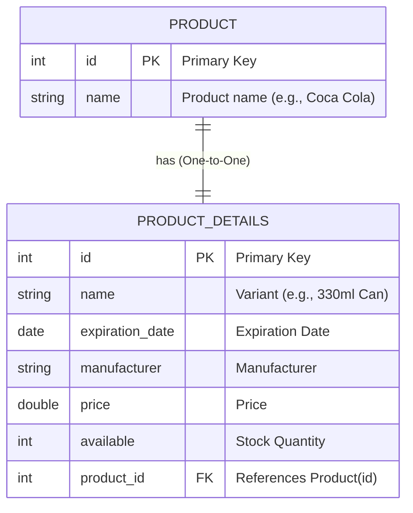
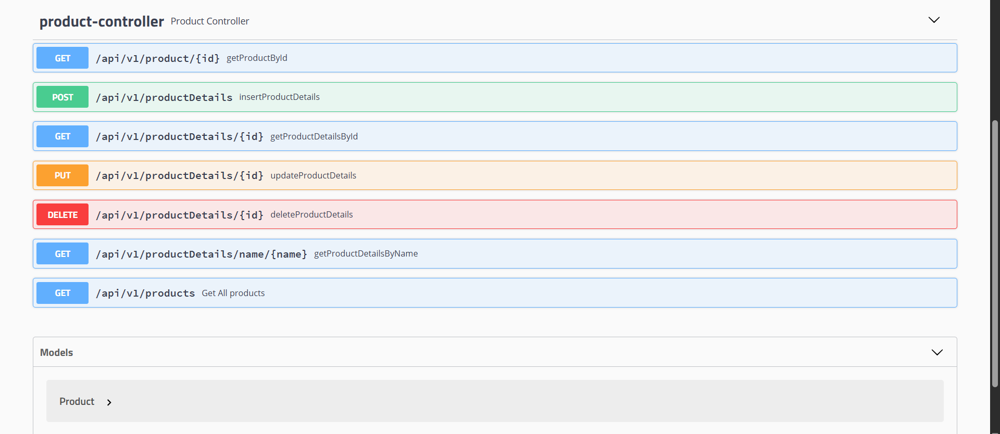

# Product Admin Panel (Spring MVC + Hibernate)

A fully functional Product Admin Panel built with Spring MVC, Hibernate, and MySQL, featuring full CRUD operations and clean layered architecture.
Includes complete Unit Tests for services and repositories.

---
## Features

- Full CRUD operations: Create, Read, Update, and Delete products.
- One-to-One relationship between Product and ProductDetails.
- Clean MVC architecture for organized code structure.
- Hibernate and JPA annotations for ORM and entity mapping.
- MySQL relational mapping with proper foreign keys.
- Transactional services ensuring data consistency.
- Complete JUnit 5  test coverage for services and repositories.

---

## 📌 Technologies Used

| Technology | Purpose |
|------------|---------|
| **Java 17** | Core backend language |
| **Spring MVC** | REST controllers, routing, and request handling |
| **Spring Core / DI** | Dependency injection & application configuration |
| **Hibernate / JPA** | ORM, entity mapping, and database operations |
| **MySQL** | Relational database for product + product details |
| **Swagger** | API documentation and endpoint testing |
| **Lombok** | Reduce boilerplate (getters, setters, constructors) |
| **Maven** | Dependency and build management |
| **JUnit 5** | Unit testing for services and controllers |
| **Tomcat** | Servlet container for running the application |

---
## Database Schema

---
## 🔗 Current Endpoints (REST API Mode)

| Method | Endpoint | Description |
|--------|----------|-------------|
| **GET** | `/api/v1/products` | Get all products |
| **GET** | `/api/v1/product/{id}` | Get a product by its ID |
| **GET** | `/api/v1/productDetails/{id}` | Get product details by ID |
| **GET** | `/api/v1/productDetails/name/{name}` | Get product details by name |
| **POST** | `/api/v1/productDetails` | Create new product details |
| **PUT** | `/api/v1/productDetails/{id}` | Update product details by ID |
| **DELETE** | `/api/v1/productDetails/{id}` | Delete product details |
---
### API Documentation

The project includes Swagger UI for exploring and testing the REST API endpoints:

